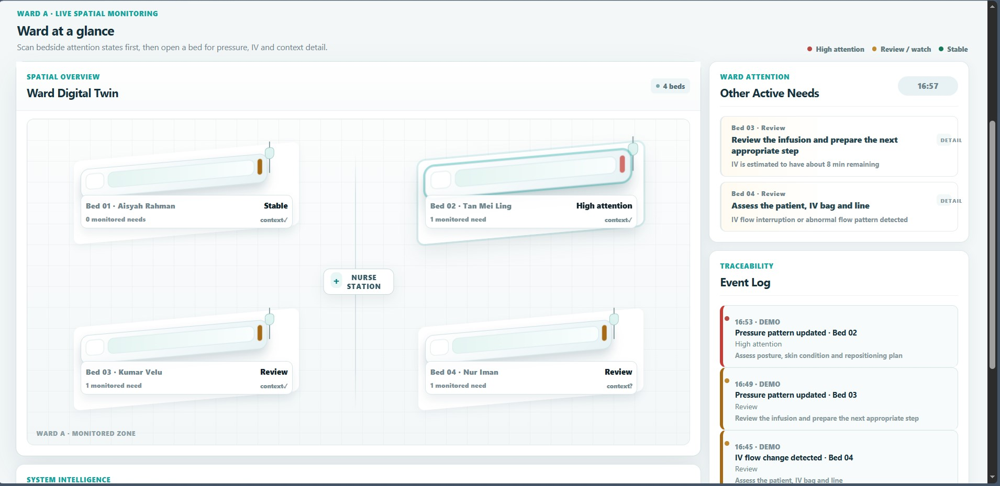

# CareHub AI

**CareHub** is an AI-assisted bedside monitoring and nurse attention-support prototype built for **Project Nexus 2026 — Healthcare Technology**.

It connects a **Smart Pressure Mat**, **Smart IV Monitor**, **Patient Call Button**, and nurse-facing **CareHub Dashboard** into one explainable monitoring workflow. The goal is not to replace nurses or perform autonomous clinical triage; CareHub helps the care team notice monitored bedside needs earlier, understand why they were surfaced, and decide what to do next.

> **Prototype boundary:** CareHub prioritises monitored bedside attention signals, not a patient's overall clinical urgency. Clinical prioritisation and final care decisions remain with healthcare professionals.

---

## Problem Statement

Nurses need to monitor multiple patients while bedside conditions can change between routine checks. Important signals may come from different places: prolonged pressure exposure, limited movement, an IV bag approaching empty or showing abnormal flow, wetness, or a direct patient call.

The problem is therefore not simply collecting more sensor readings. Raw readings alone can create noise and force nurses to mentally combine disconnected information while already managing a busy ward.

**How might we continuously monitor important bedside signals, interpret them with relevant patient context, and surface clear, explainable attention needs without pretending that an automated system can replace clinical judgement?**

CareHub focuses on three gaps:

1. **Continuous visibility** — bedside pressure and IV conditions can change between manual checks.
2. **Fragmented signals** — pressure, IV, wetness and patient-call events are easier to act on when presented together.
3. **Explainability** — nurses should be able to see the signal, interpretation and patient context behind an attention cue instead of receiving an opaque risk score.

---

## Solution

CareHub uses a simple pipeline:

**Bedside sensors → Signal interpretation → Patient context → Care Attention → Nurse review**

### 1. Smart Pressure Mat

The pressure-mat interface visualises an **8 × 8 relative pressure field** and supports pressure-pattern interpretation such as posture, sustained exposure and movement/redistribution gaps.

The current dashboard uses prototype/demo pressure data. The intended AI integration is a trained pressure model that can consume real pressure-mat readings and output interpreted states such as posture and persistent pressure patterns. The UI is already structured so this model output can replace the current prototype interpretation without redesigning the dashboard.

### 2. Smart IV Monitor

A load-cell-based IV monitor tracks estimated remaining fluid and flow behaviour. CareHub can surface low remaining volume or abnormal/interrupted flow for nurse review. This component is intentionally deterministic; it does not need a fabricated AI layer to be useful.

### 3. Patient Call and Bedside Signals

Patient-call and wetness events can enter the same attention model when available, giving the nurse one place to review monitored bedside needs.

### 4. Explainable Care Attention

Instead of generating an opaque clinical score, CareHub evaluates each monitored need separately and presents states such as **High Attention**, **Review / Watch**, and **Stable**.

The dashboard shows:

- the raw monitored signal;
- the interpreted bedside pattern;
- relevant patient context such as mobility, pressure-risk band and self-reposition ability;
- the resulting attention state;
- a suggested review workflow; and
- missing context when the prototype does not have enough information.

### 5. Nurse Dashboard

The nurse-facing interface has two levels:

- **Ward Overview** — a 2.5D Ward Digital Twin, Care Attention Queue, ward summary, event history and live processing flow.
- **Bed Detail** — pressure-mat visualisation, posture interpretation, IV status, patient context, explainable attention reasoning and acknowledgement workflow for the selected bed.

---

## Dashboard Preview

### Ward Overview

The first screen gives nurses a ward-level view of all monitored beds, current attention states, the Care Attention Queue, live processing flow and recent events.



### Bed Detail

Selecting a bed opens a focused bedside view with the Smart Pressure Mattress, posture interpretation, IV monitoring, patient context, explainable reasoning and recommended nurse review workflow.


---

## User Flow

```text
Patient / bedside condition changes
                ↓
Pressure mat / IV monitor / call button captures a signal
                ↓
ESP32 / data bridge sends a standardised bedside packet
                ↓
CareHub interprets the monitored signal
                ↓
Relevant patient context is applied
                ↓
An explainable Care Attention state is surfaced
                ↓
Nurse sees the bed in Ward Overview / Care Attention Queue
                ↓
Nurse opens Bed Detail
                ↓
Signal → interpretation → context → attention is shown
                ↓
Nurse reviews the patient using clinical judgement
                ↓
Nurse acknowledges the monitored need
                ↓
Continuous monitoring continues
```

### Example: persistent pressure pattern

```text
Pressure distribution persists + movement gap increases
                         ↓
CareHub identifies a sustained pressure pattern
                         ↓
Context: high pressure-risk band + very limited mobility
                         ↓
HIGH ATTENTION — persistent pressure pattern requires review
                         ↓
Nurse opens the bed, reviews posture / skin condition /
positioning plan, then acknowledges the alert
```

### Example: IV change

```text
Load cell detects low remaining fluid or abnormal flow
                         ↓
IV state is updated
                         ↓
CareHub surfaces the monitored IV need
                         ↓
Nurse opens Bed Detail and reviews the patient, IV bag and line
```

---

## System Architecture

```text
┌─────────────────────────────────────────────────────────┐
│                    BEDSIDE HARDWARE                     │
│  Pressure Mat        IV Load Cell       Call / Wetness │
└───────────────┬─────────────────────────────────────────┘
                │ ESP32 / standardised JSON packet
                ▼
┌─────────────────────────────────────────────────────────┐
│                  INTERPRETATION LAYER                   │
│  Pressure pattern / posture   │   IV monitored state   │
└──────────────────────┬──────────────────────────────────┘
                       ▼
┌─────────────────────────────────────────────────────────┐
│                   PATIENT CONTEXT                       │
│ Pressure risk · Mobility · Self-reposition · Constraints│
└──────────────────────┬──────────────────────────────────┘
                       ▼
┌─────────────────────────────────────────────────────────┐
│                 CARE ATTENTION ENGINE                   │
│ Explainable monitored needs · Missing-context handling │
└──────────────────────┬──────────────────────────────────┘
                       ▼
┌─────────────────────────────────────────────────────────┐
│                    NURSE DASHBOARD                      │
│ Ward Overview → Bed Detail → Review → Acknowledge      │
└─────────────────────────────────────────────────────────┘
```

### Main dashboard modules

- `carehub-attention-core.js` — context-aware, explainable attention logic.
- `dashboard-v2.js` — dashboard state, demo/hardware data handling and rendering.
- `dashboard-navigation.js` — Ward Overview ↔ Bed Detail navigation.
- `demo-visuals.js` — pressure, posture, IV and processing-flow visualisation enhancement.
- `index.html` — dashboard shell.
- `real-render-corrections.css` / `.js` — final browser-tested presentation corrections.

The older `carehub-core.js` and `app.js` are retained only as Phase 1 reference and are not loaded by the current dashboard.

---

## Data Contract and Hardware Integration

The dashboard is designed to consume **standardised interpreted bedside data**, rather than coupling the UI directly to raw sensor implementation details.

A current ESP32 bridge packet looks like:

```json
{
  "bedId": "Bed 01",
  "pressure": {
    "zones": [22, 68, 91, 44],
    "highDurationSec": 75,
    "lastMovementMin": 28
  },
  "iv": {
    "remainingMl": 42,
    "flowMlPerMin": 6,
    "abnormalFlow": false
  }
}
```

The pressure visual currently expands prototype zone values into an 8 × 8 display for demonstration. Future integration can replace this with the real pressure matrix / trained pressure-model output while keeping the same nurse-facing workflow.

Hardware documentation:

- `firmware/carehub_esp32/carehub_esp32.ino`
- `docs/hardware/wiring.md`
- `docs/hardware/data-protocol.md`
- `docs/hardware/calibration.md`

---

## Deployment and Running the Prototype

CareHub is a static front-end dashboard using JavaScript ES modules. **Do not open `index.html` directly with `file://`**; browsers can block module imports in that mode.

### Option A — Local dashboard / presentation mode

From the repository root:

```bash
python -m http.server 8080
```

On Windows, if `python` is unavailable:

```bash
py -m http.server 8080
```

Then open:

```text
http://localhost:8080
```

The dashboard starts in **simulated mode**, with four demonstration beds. This is the presentation-safe fallback and does not require physical hardware.

### Option B — Hardware rehearsal mode

Start the mock/data bridge:

```bash
npm run bridge:mock
```

The dashboard can poll:

```text
http://localhost:3001/latest
```

when Hardware Mode is enabled. The same bridge boundary can be used for the ESP32 integration so the UI does not need to know how individual sensors are wired.

### Option C — Static web deployment

Because the dashboard has no build step, it can be hosted by any static host that serves the repository files over HTTP/HTTPS, for example Vercel, Netlify, GitHub Pages or a conventional web server.

Deployment requirements:

- serve `index.html` from the project root;
- preserve the relative `.js` and `.css` file paths;
- serve JavaScript modules over HTTP/HTTPS rather than `file://`;
- if Hardware Mode is used from a hosted dashboard, expose the bridge through a reachable API endpoint and configure the required CORS/network access instead of relying on `localhost:3001` on another machine.

For competition demonstrations, **simulated mode is intentionally retained as a fallback** so the dashboard can still demonstrate the full nurse workflow if physical hardware connectivity is unavailable.

---

## Demo Walkthrough

A concise competition demo can follow this sequence:

1. Start at **Ward Overview** and show the four monitored beds.
2. Trigger or receive a persistent pressure pattern for Bed 02.
3. Show the Ward Digital Twin and Care Attention Queue update.
4. Open **Bed 02 Detail**.
5. Walk through pressure distribution, posture, movement gap and patient context.
6. Show the explainable path: **signal → interpretation → context → attention**.
7. Acknowledge the monitored need as the nurse.
8. Trigger an IV abnormal-flow / low-volume scenario and show the dashboard update again.

This demonstrates both the physical sensing loop and the human-in-the-loop decision-support workflow without claiming autonomous clinical triage.

---

## Validation and Checks

Run the repository checks with:

```bash
npm test
npm run check
```

Current validation is prototype-level. Clinical workflow rules and stronger medical claims should be reviewed against healthcare guidance and validated with registered nurses before any real clinical deployment.

---

## Current Prototype Status

**Implemented**

- Multi-bed Ward Overview and 2.5D Ward Digital Twin
- Bed-specific Detail views
- Explainable Care Attention engine
- Pressure-mat and posture visualisation
- IV monitoring visualisation
- Patient-context handling
- Care Attention Queue
- Event log and acknowledgement workflow
- Simulated scenarios and hardware bridge boundary
- Responsive browser UI

**Integration / validation work still required for real-world use**

- Real 8 × 8 pressure-mat hardware stream
- Trained pressure/posture model output
- Full physical ESP32 end-to-end integration
- Production backend / persistence
- Clinical workflow validation
- Medical-device-grade safety, security and regulatory validation

CareHub is currently a **competition prototype and decision-support demonstration**, not a clinically deployed medical device.
